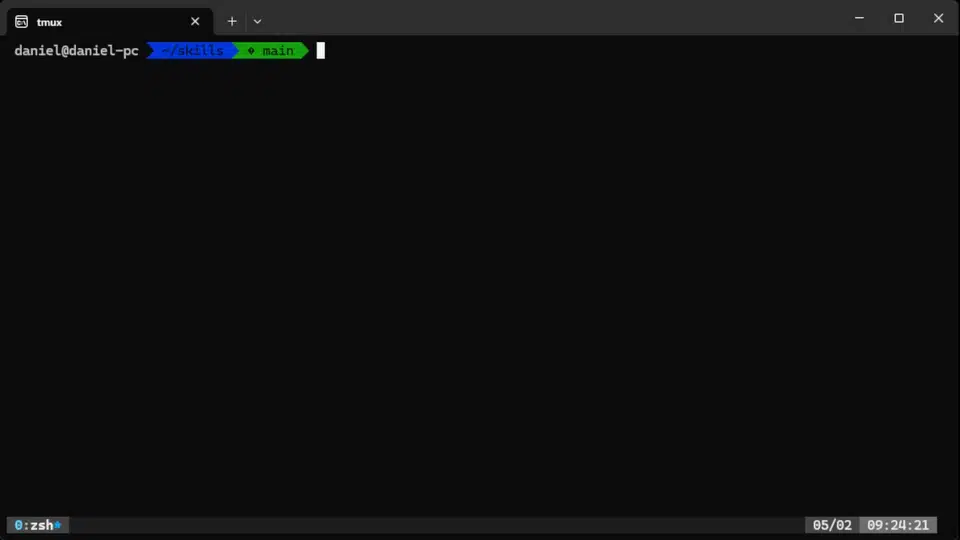

# Claude Code Skills

A collection of reusable skills for [Claude Code](https://claude.ai/claude-code) that extend functionality with custom commands.

## Plugins

### Sessions

Save and resume Claude Code sessions. Create timestamped session summaries with `/save-session` and pick up where you left off with `/resume-session`.

#### `/save-session`

Creates a timestamped summary of your current session, capturing:

- What you worked on (files, features, fixes, research)
- Key outcomes and accomplishments
- Files changed with descriptions
- Next steps as an actionable checklist
- Session notes and learnings

Session files are saved to `.claude-sessions/` in your project directory (or `~/.claude-sessions/` for user-level sessions).

**Usage:**
```
/save-session [optional description]
```

#### `/resume-session`

Loads a previous session summary to restore context. Supports:

- Finding the latest session automatically
- Resuming by full file path
- Searching by session ID or partial description
- Listing all available sessions

**Usage:**
```
/resume-session
/resume-session [session-id or description]
```

## Installation



## Project Structure

```
skills/
├── .claude-plugin/
│   └── marketplace.json    # Plugin registry metadata
└── plugins/
    └── sessions/
        └── skills/
            ├── resume-session/
            │   └── SKILL.md
            └── save-session/
                └── SKILL.md
```

## Creating New Skills

Skills are defined using `SKILL.md` files with declarative instructions. To add a new skill:

1. Create a directory under `plugins/<plugin-name>/skills/<skill-name>/`
2. Add a `SKILL.md` file with the skill definition
3. Register the plugin in `.claude-plugin/marketplace.json`

## Author

Daniel Moore

## License

MIT
